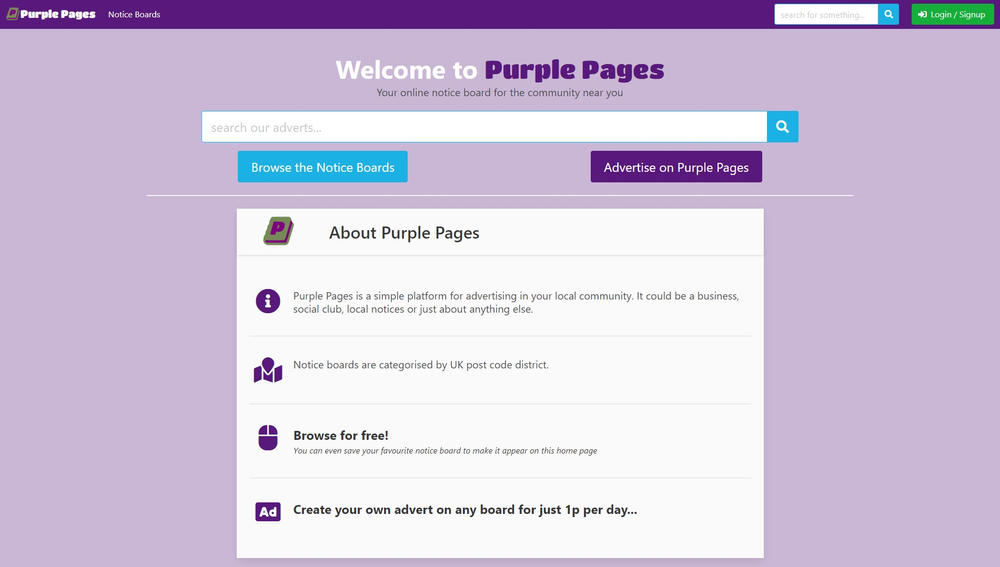

# Purple Pages

## Online notice boards for local communities

[](https://travis-ci.com/davebland/purple-pages)

A full stack framework milestone project for Code Institute.

Django web application utilising Bulma CSS framework, Postgres relational database, Stripe payments, AWS storage and Heroku hosting.

## Premise

The basic premise of this application is to create subscription based online ‘notice boards’ on which local communities can advertise events, products and services. The inspiration from offline resources such as printed local directory publications (e.g. Yellow Pages) and physical community notice boards as found in the centre of villages and towns all over the UK.

Users will be able to browse the site as guests but will need to pay a subscription fee to advertise on a notice board. The fee is minimal (1p per day) to encourage take-up.

Initially the notice boards will be segregated into UK postcode districts. Districts are the second largest geographical used by the post code system and are represented by the first 2-4 characters of a standard UK postcode (e.g. W1 xxx). There are approximately 3000 active districts in the UK and in the real world these represent communities with an average size of 22,000 people. The list of districts comes from a free online resource, see credits.

## Demo

Browse the demo @ https://purple-pages.herokuapp.com



## UX

I wanted the design of the site to be ‘clean’ and minimal with the notice boards themselves taking cues from a physical notice board found in town/village centres, local shops etc. E.g. lots of individual ads of various sizes pinned to the board in a loose grid format.

I decided to use Bulma CSS framework to build the front-end templates as I like the range of UI components available and wanted to deviate from the common Bootstrap styling. Bulma was all well suited to the notice board nature of the application due to its 'column', ‘box’, ‘card’ and ‘tile’ components.

The colour scheme of the site is purple with a simple set of complementing colours to reflect the application’s name.

Before starting development, the ‘look and feel’ of each page was sketched using draw.io planning tool. I also planned the structure of the data models using the same tool. Details in the planning directory within the source code. 

### User Stories

1.	Users should not need any instruction on using the site other than the visual and text cues on the pages themselves.
2.	Browsing the notice boards is straightforward (not more than 2 clicks to get to any given board) and doesn’t require a user to register for an account.
3.	A user must register on the site to design an advert but may do so without initially paying a subscription fee.
4.	When creating an advert is must be clear what input is required/allowed in each field.
5.	Once created, the advert owner must be able to edit or delete the advert. 
6.	A user must pay a subscription fee in order for their adverts to be visible on the notice boards for other site users to see.
7.	Paying a subscription fee should be a simple process but user’s must not be able to circumvent it. The subscription process should not be successful until a valid payment complete webhook has been received from Stripe.
8.	User’s must be able to change their own password and also recover a forgotten password at any time.
9.	The site must be fully responsive and render equally well on mobile as on desktop views.

## Notable Features

- Secure online payments using Stripe payment intents to comply with EU SCA requirements. Includes 3D secure where applicable.
- Ability for users to save a 'favourite' notice board which replaces standard home page content. This is either stored in user profile for an authenticated user or in local cookie for a guest.
- Custom Django user model which extends the standard user with additional Purple Pages properties.
- Ability to post colour coded notifications on any page using Django messaging system.
- Customisation of the Bulma CSS framework using SASS
- Ability for user to upload custom images to adverts and have these stored in persistent datastore, AWS S3. This is achieved with ```django-storages``` and each advert having a UUID under which images are organised in the bucket.

## Future Additions

- Improved search functionality to filter by notice board
- Addition of categories to better organise adverts (e.g. product, service, social club etc.)
- Live preview of advert images on the create advert page
- Automatic resizing of uploaded images into thumbnails for better loading times
- Tiered pricing structure according to number of adverts and number of boards used

## Technologies

- HTML5
- CSS3
    - Bulma.io CSS framework 0.8.0 (customised for Purple Pages with SASS)
- JavaScript
    - jQuery 3.4.1 (externally linked)
- Python 
    - Django 3.0.2
    - Whitenoise 5.0.1
    - Django Storages (for AWS S3) 1.9.1
- Stripe Payments
    - Stripe for Python 2.43
    - Stripe Elements JavaScript v3 (externally linked for security)
- Font Awesome (latest version via external kit link)
- Google Fonts

## Testing

Purple Pages was built from the start with test driven development in mind. Within each Django app there is a test.py with unit tests (using Django’s TestCase) that are relevant to the models, views and forms within that app. In most cases the process followed for each piece of functionality was to write a test that determined if the functionality was working (failing initially), then build the functionality and get the test to pass.

I have used Python’s coverage package to check the testing hits as much of the code as possible (collected by using ```coverage run manage.py test```). The coverage configuration file ```.converagerc``` has exclusions from coverage such as the python virtual env and Django’s own python code.

Purple Pages has 26 individual test functions giving 88% coverage of the sites code. 

There is continuous integration testing using Travis-CI. This involved setting up the repository on travis-ci.com and added ```.travis.yml``` configuration file to the project. Travis-CI automatically sets up and environment and runs ```python manage.py test``` each time a commit is made to GitHub. The current status of the test is reflected in the badge at the top of this readme. One challenge with Travis-CI was setting up the skipping of Stripe payment tests using ```@skipIf``` decorator in this environment (Stripe environment variables deliberately not added to Travis to reduce exposure of secret key).

Postman used for basic testing of POST request to the Purple Pages Stripe webhook endpoint.

Cross browser testing carried out on Chrome, Firefox & Edge. Purple Pages works best on Chrome.

Mobile device testing carried out using Chrome developer tools and real device.

### User Story Testing

1.	Users should not need any instruction on using the site other than the visual and text cues on the pages themselves.
__Simple clear buttons and cues, tested by non-technical family members__
2.	Browsing the notice boards is straightforward (not more than 2 clicks to get to any given board) and doesn’t require a user to register for an account.
__Maximum 2 clicks from anywhere (Notice Boards->Board) and login not required__
3.	A user must register on the site to design an advert but may do so without initially paying a subscription fee. 
__Create advert view not available to unauthenticated users, once authenticated users can create/edit adverts but get a reminder that the adverts aren’t visible until a subscription payment is made__
4.	When creating an advert is must be clear what input is required/allowed in each field.
__Fields have placeholder text where applicable and a separate instruction box that scrolls down the page with the user__
5.	Once created, the advert owner must be able to edit or delete the advert.
__Clear controls for this on ‘My Ads’ page. Additional user prompt before any advert deleted__
6.	A user must pay a subscription fee in order for their adverts to be visible on the notice boards for other site users to see.
__Internally the query for adverts on a board filters out any adverts where the user does not have an active subscription. Subscription can only be active is a user has made a purchase on the subscription page__
7.	Paying a subscription fee should be a simple process but user’s must not be able to circumvent it. The subscription process should not be successful until a valid payment complete webhook has been received from Stripe.
__Subscription view has defensive programming so users can select different subscription periods but a subscription will only be extended by the number of days selected. Once a payment has been made the subscription is only updated when a ``payment_intent.succeeded``` webhook is received from Stripe. This means if the user fails, abandons or loosed connection during a payment the subscription will not be erroneously updated__
8.	User’s must be able to change their own password and also recover a forgotten password at any time.
__Clear link in user profile to change password. Django’s forgotten password mechanism available and customised for Purple Pages styling__
9.	The site must be fully responsive and render equally well on mobile as on desktop views.
__Bulma CSS framework is inherently fully responsive and Purple Pages is designed ‘mobile first’ so all aspects of the site work well on mobile as well as desktop__ 

## Technical Challenges

- Setting up advert previews via AJAX request – had to ensure that CSRF token was passed in the post data and that error responses from the form validation were correctly feedback to the user.
- Manual import routine for postcode districts – to get the 3k+ postcode districts into the datastore I created a manual import function (postcode_import.py) that takes a csv file and bulk creates and saves ```PostCodeDistrict``` models.
- To display form fields with a consistent ‘Bulma’ styling I created a form template. To determine from inside the template which html mark-up was required I added an attribute to the Django form widget, ‘element’. Strictly this attribute should be in format data-* however the templating language couldn’t deal with a hyphen. This is an unresolved bug in the application but doesn’t affect the functionality or styling.
- Setting up and handling a Stripe webhook on ```payment_intent.succeeded``` . Purple Pages has to receive and handle a user’s successful subscription payment independently of the user’s interaction with the site. This is achieved by added metadata to the ```payment_intent``` so that the subscription payment can be attributed to the correct user and subscription expiry date updated at any time after the user initiates payment (e.g. to account for payments that take a while to complete or user’s that abandon the process). The payment reference is then stored in the Purple Pages datastore against the user for future traceability.

## Deployment

Initial development was done locally with Django’s ```runserver``` and a flat file sqlite3 datastore.

Purple Pages is deployed publicly as a Heroku app. Deploying to Heroku involved:

* Creating Heroku application on free dyno
* Created of Procfile to tell Heroku how to serve Purple Pages
* Added Gunicorn WSGI webserver
* Created Heroku Postgres database and linked to this in ```settings.py``` using ```dj_database_url``` package
* Added ```whitenoise``` to serve static files
* Setting up Heroku config vars with all appropriate credentials so these are not saved in code

Because users can upload their own images to adverts a persistent file store was needed. During development I used local file store with ``` django-relativefilepathfield``` package in the advert model to ensure the application worked independently of the underlying directory structure. In production Purple Pages uses an AWS S3 bucket to store and serve advert images. Setting up S3 integration involved:

* Installing ```django-storages```, ```boto3``` and associated packages to give access to S3 API
* Setting up S3 bucket and access credentials in AWS
* Adding AWS and S3 configuration settings to ```settings.py``` and environment variables.
* Configuring media files to be saved to and served from S3 (S3 files are not public by default, Django supplies authorisation key within each image href attribute).

Purple Pages also uses AWS for sending emails (account setup, password recover etc). This is done with AWS SES service as SMTP server and configured within ```settings.py``` and environment variables.

## Content

- List of UK postcode districts from https://www.doogal.co.uk - available under public licence

## Acknowledgements

- Draw.io wireframing tool
- Bulma.io official documentation
- jQuery official documentation
- Python and Django official documentation
- Stripe APIs official documentation
- Postman https://www.postman.com
- Travis-CI https://travis-ci.com
- HTML5 validator https://validator.w3.org